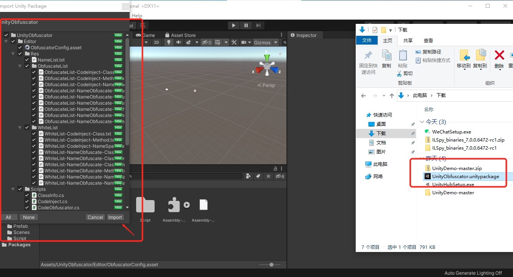
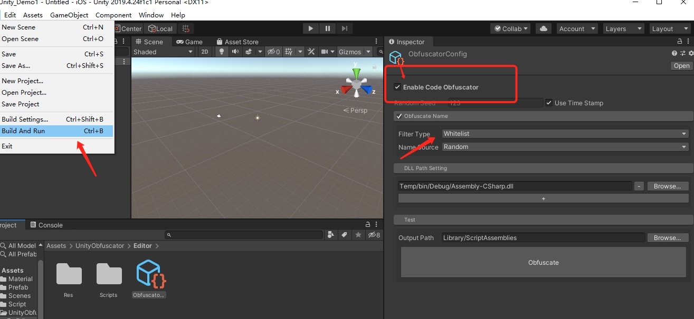
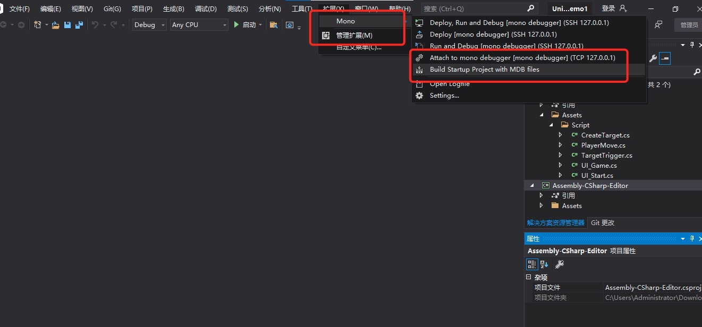
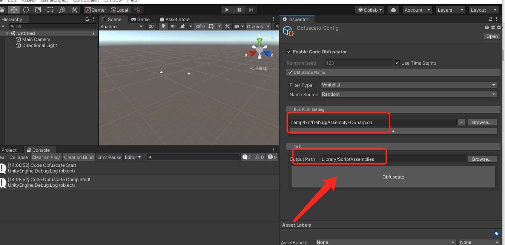
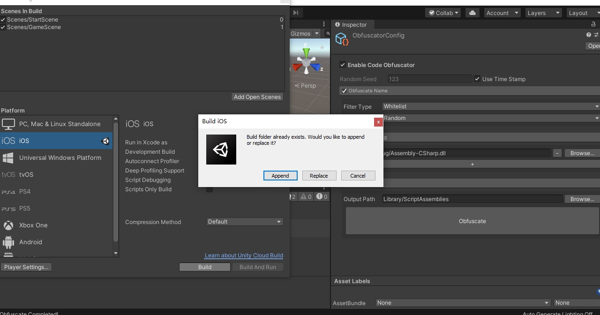
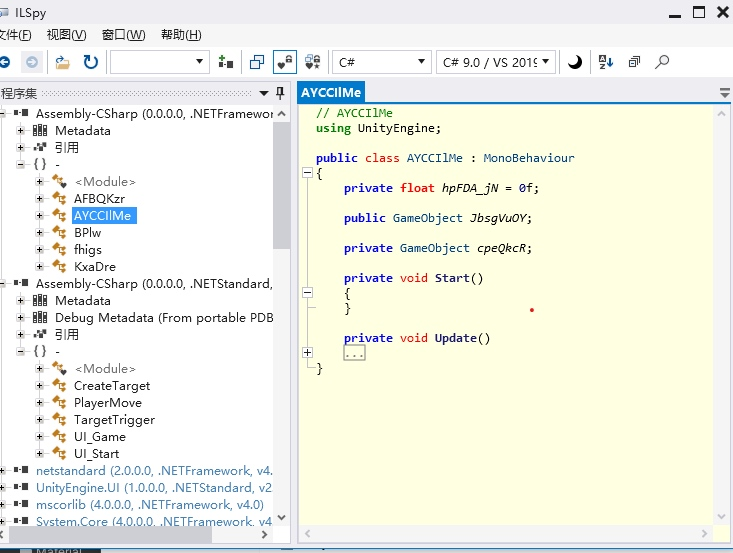

# UnityObfucation使用文档和注意事项

###一. 使用步骤 2018版本

1、打开Unity项目后双击UnityPackage，导入unityPackageage，

2、在左下方找到ObfuscateConfig，勾选Enable Code Obfuscate，Obfuscate Names后直接Build就可以完成混淆




###二. 使用步骤 2019版本
由于2019版本默认生成/Library/ScriptAssemblies/Assembly-CSharp.dll 和Assembly-CSharp.dll.pdb，没有生成Assembly-CSharp.dll.mdb文件，需要手动转换
1. 项目正常完成Build
2. 使用Visual Studio 扩展->管理扩展，添加VSMonoDebuger插件，选择Build Startup Project With MDB Files 后生成mdb文件，

产物生成路径位于项目路径->Temp->bin->Debug
3. 在Obfuscate的Inspactor中设置 DLL PATH Setting 和 Output Path

然后手动点击混淆Obfuscate按钮
4. 再完成项目的Build，Append添加编译



### 三. 效果展示
使用ILSpy开源软件打开/Library/ScriptAssemblies/Assembly-CSharp.dll ，对比分析混淆效果



### 四. 注意事项
##### 1. 支持版本2018LTS和2019LTS版本
##### 2. Assembly-CSharp.dll.mdb第二中转换方式
需要在Windows机器上使用Unity自带工具进行转化
```
C:\Program Files\Unity\Hub\Editor\2018.4.33f1\Editor\Data\MonoBleedingEdge\bin>mono.exe   "C:\Program Files\Unity\Hub\Editor\2018.4.33f1\Editor\Data\MonoBleedingEdge\lib\mono\4.5\pdb2mdb.exe" Z:\Win\u3d\UnityDemo-master\Unity_Demo1\Library\ScriptAssemblies\Assembly-CSharp.dll
```
##### 3. Package 默认生成ObfuscatorConfig配置问题，
若遇因版本兼容的问题导致，ObfuscatorConfig的Inspector面板加载失败，需要删除后再次在Editor文件夹里Create->Obfuscator Config
##### 4.函数黑名单

```
//函数黑名单
            #region MonoBehaviour Message
            "Awake",
            "FixedUpdate",
            "LateUpdate",
            "OnAnimatorIK",
            "OnAnimatorMove",
            "OnApplicationFocus",
            "OnApplicationPause",
            "OnApplicationQuit",
            "OnAudioFilterRead",
            "OnBecameInvisible",
            "OnBecameVisible",
            "OnCollisionEnter",
            "OnCollisionEnter2D",
            "OnCollisionExit",
            "OnCollisionExit2D",
            "OnCollisionStay",
            "OnCollisionStay2D",
            "OnConnectedToServer",
            "OnControllerColliderHit",
            "OnDestroy",
            "OnDisable",
            "OnDisconnectedFromServer",
            "OnDrawGizmos",
            "OnDrawGizmosSelected",
            "OnEnable",
            "OnFailedToConnect",
            "OnFailedToConnectToMasterServer",
            "OnGUI",
            "OnJointBreak",
            "OnJointBreak2D",
            "OnMasterServerEvent",
            "OnMouseDown",
            "OnMouseDrag",
            "OnMouseEnter",
            "OnMouseExit",
            "OnMouseOver",
            "OnMouseUp",
            "OnMouseUpAsButton",
            "OnNetworkInstantiate",
            "OnParticleCollision",
            "OnParticleTrigger",
            "OnPlayerConnected",
            "OnPlayerDisconnected",
            "OnPostRender",
            "OnPreCull",
            "OnPreRender",
            "OnRenderImage",
            "OnRenderObject",
            "OnSerializeNetworkView",
            "OnServerInitialized",
            "OnTransformChildrenChanged",
            "OnTransformParentChanged",
            "OnTriggerEnter",
            "OnTriggerEnter2D",
            "OnTriggerExit",
            "OnTriggerExit2D",
            "OnTriggerStay",
            "OnTriggerStay2D",
            "OnValidate",
            "OnWillRenderObject",
            "Reset",
            "Start",
            "Update",
            #endregion
        };
```

##### 5.黑白名单使用
```
ObfuscateList-Class.txt  //名单内的类（包括类名和类成员名）都会被混淆
ObfuscateList-ClassExceptClassName.txt  //名单内的类的类成员名会被混淆，但类名不混淆
ObfuscateList-ClassMember.txt  //名单内的类成员名会被混淆
ObfuscateList-Method.txt  //名单内的方法名会被混淆
ObfuscateList-Namespace.txt  //名单内命名空间里内容包括（命名空间名、类名、类成员名）都会被混淆
ObfuscateList-NamespaceExceptNamespaceName.txt  //名单内命名空间内容（包括类名、类成员名）都会被混淆，但命名空间名不混淆 
WhiteList-Class.txt   //名单内的类（包括类名和类成员）不混淆
WhiteList-ClassMember.txt   //名单内的类成员不混淆
WhiteList-ClassNameOnly.txt   //名单内的类的类名不混淆，但类成员混淆
WhiteList-Method.txt   //名单内的方法名不混淆
WhiteList-NameSpace.txt   //名单内的命名空间里内容（包括命名空间名、类名、类成员名）都不混淆
WhiteList-NamespaceNameOnly.txt   //名单内的命名空间的名字不混淆
```
名单写法：NamSpace|Class|Method

